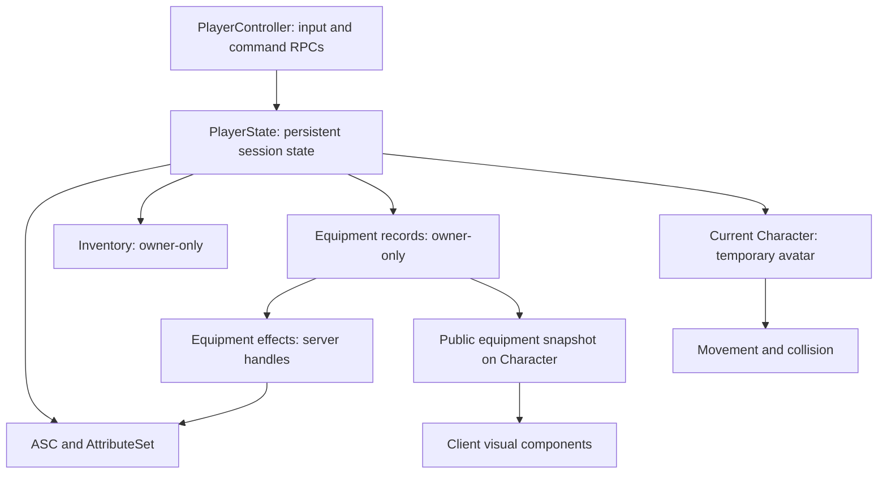

# Beast Kingdom Online — วิเคราะห์และออกแบบต่อ M1

วันที่: 21 กันยายน 2026 · Revision: proposal-r1

**ข้อสรุป:** M1 มีวงจรที่เหมาะสำหรับพิสูจน์เกมแล้ว แต่ควรแก้ ownership หลัง respawn, transaction ของไอเท็ม, ผลการต่อสู้ผ่านเครือข่าย และสมดุล Wolf ตัวแรก ก่อนนำ task list เดิมไปพัฒนา การต่อยอดรอบนี้ให้น้ำหนักทั้งประสบการณ์เล่นและความถูกต้องของระบบ

เอกสารนี้เป็น **ข้อเสนอออกแบบ** ไม่ใช่การยืนยันอนุมัติหรือรายงานว่าเกมถูกสร้าง/ทดสอบแล้ว ใช้ `2026-09-21-bko-m1-vertical-slice-design.md` ที่ผู้ใช้ให้เป็นฐาน ไม่เปลี่ยนไฟล์ต้นฉบับ และไม่ได้อ่าน GDD v0.3 ซึ่งต้นฉบับอ้างถึง เพราะไม่มีเนื้อหา GDD อยู่ในเอกสารที่พบ

ประเภทข้อมูลในเอกสาร:

- **ข้อค้นพบ:** ความขัดแย้งหรือช่องว่างที่ตรวจจากต้นฉบับ
- **ข้อเสนอ:** กติกาหรือค่าที่ออกแบบเพิ่มเพื่อให้เริ่มพัฒนาได้
- **ผลคำนวณ:** มาจาก seed data และแบบจำลอง ไม่ใช่ผล playtest
- **เป้าหมายทดสอบ:** ต้องพิสูจน์บน build และอุปกรณ์จริง

## 1. จุดยืนของ M1

คง UE + C++ + GAS, server authoritative, game module เดียว, 1 แผนที่ 2 โซน, Shiba หนึ่งตัว, Wolf หนึ่งชนิด, สามสกิล, สาม equipment slots, inventory 30 ช่อง, recipe เดียว, PC + Android และไม่มี backend/save ตามเดิม

M1 ควรตอบคำถามสามข้อ:

1. ผู้เล่นอ่านจังหวะโจมตี หลบ และชนะ Wolf ได้โดยไม่ต้องรู้สูตรหรืออัป STR ตามคำบอกหรือไม่
2. การเก็บวัตถุดิบ → คราฟต์ → ใส่ดาบ ทำให้ผู้เล่นรู้สึกว่าตัวละครพัฒนาขึ้นหรือไม่
3. สถานะของโลกและผู้เล่นยังถูกต้องเมื่อมีสองคน, latency, ตาย, เกิดใหม่ และเข้าเกมกลางรอบหรือไม่

**Definition of Done ที่ขยายความ:** ผู้เล่นแต่ละคนทำวงจร `Town → Wolf → Loot → Craft → Equip → ลองดาบใหม่` ได้บน build จริง; อีกคนเห็น equipment ถูกต้อง; ตายและเกิดใหม่แล้วของ/แต้ม/โบนัสไม่หายหรือเพิ่มซ้ำ และมีหลักฐาน performance จาก Android เครื่องที่ระบุรุ่นแน่นอน

Listen Server สำหรับ M1 ให้ PC เป็น host และ Android เป็น remote client ผ่าน LAN/IP เดียวกัน ไม่เพิ่ม lobby, matchmaking, NAT traversal หรือ host migration รอบนี้ การผ่าน PIE สองหน้าต่างยังไม่แทนการทดสอบ Android เชื่อมต่อจริง และยังไม่ใช่ข้อพิสูจน์ว่าเกมรองรับระดับ MMO

## 2. ปัญหาที่ควรปิดก่อนพัฒนา

| ระดับ | ข้อค้นพบจากต้นฉบับ | ผลที่เสี่ยงเกิด | ข้อเสนอ |
|---|---|---|---|
| P0 | §2.1/5.11/5.16 เก็บ equipment บน Pawn แต่ inventory/ASC อยู่ PlayerState | Pawn ถูกทำลายแล้ว item record หาย แต่ GE โบนัสยังอยู่ | ย้าย equipment จริงไป PlayerState; Pawn เก็บภาพอุปกรณ์สำหรับทุกคนเห็น |
| P0 | §4.3/5.1 รวม equip mods ใน recalc และ apply GE อีก | โบนัสถูกบวกสองครั้ง; Crit+2 อาจตกหล่น | แยก base derived กับ GE modifiers ชัดเจน |
| P0 | §2.3/5.19 ใช้ OnDamaged แต่ไม่มี transport ไป client | เลข damage/crit/miss เห็นเฉพาะ server หรือข้อมูลผิด | กำหนด CombatResult และส่ง cosmetic event โดยตรง |
| P0 | §5.13 ถอนของก่อนเพิ่มผลลัพธ์; คำว่า 1 RPC ไม่รับประกัน rollback | คราฟต์พลาดแล้วของ/Gold หายบางส่วน | Plan จาก snapshot → ตรวจทั้งหมด → commit ทั้งชุด |
| P0 | §4.4 ผู้เล่น L1 เจอ Wolf L5 DEF15 | Basic hit เพียง 2 damage; progression เริ่มต้นติดขัด | ปรับ Wolf ตัวเดิมเป็นศัตรูเริ่มต้น แล้ววัดเวลาต่อสู้ |
| P1 | §4.3 clamp ก่อน floor/variance และไม่มี AtkSpeed base | Hit อาจได้ 0; cooldown ไม่มีสูตรครบ | clamp จำนวน damage สุดท้าย; ระบุหน่วย/สูตรทุกค่า |
| P1 | §5.8 Wander แต่ §6.2 ตั้ง dormancy ตอน idle | Wolf เดินบน server แต่ client ไม่อัปเดต | ให้ Wolf awake ตลอดใน M1 |
| P1 | Safe zone ไม่มี enforcement; ไม่มี healing นอกจาก respawn | กัดข้ามเมือง/ใช้การตายแทนการรักษา | server safe volume + พักฟื้นที่ช่างเดิม |
| P1 | §5.3/5.6 ไม่ระบุ payload, hit timing, cancel และ dedup | dash คนละทิศ/ตีซ้ำ/โจมตีหลังตาย | สัญญา activation และผลลัพธ์ต่อ target ที่แน่นอน |
| P1 | UI เปิด craft กับ Server_Craft ไม่ผูก context ชัด | เดินออกจาก NPC แล้วยังทำรายการ/feedback ไม่ครบ | server ตรวจ NPC/ระยะ/สถานะใหม่ทุกคำสั่ง |
| P1 | §7.2 จำนวนชิ้น mesh/outline มีต้นทุนบนมือถือที่ยังไม่วัด | triangle น้อยแต่ draw calls/overdraw สูง | ทดสอบตัวแทน art หนึ่งชุดก่อนทำทั้งชุด |
| P2 | §10 ทำ Shiba art ครบก่อน loop เล่นได้ | ลงงาน art ก่อนรู้ว่าจังหวะเกมเหมาะหรือไม่ | greybox loop ให้ครบก่อน แล้วแทน art ทีละส่วน |

P0 = กระทบ correctness หรือทำให้วงจรหลักเริ่มไม่ได้; P1 = ต้องปิดก่อนรับ M1; P2 = ลดต้นทุนและงานย้อนแก้

## 3. ประสบการณ์ 10–15 นาทีแรก

เวลาเหล่านี้เป็นเป้าหมาย playtest หลังปรับ Wolf ไม่ใช่คำรับรองจากแบบจำลอง loot

| ช่วงเวลา | ประสบการณ์ที่ต้องเกิด | งานระบบ/UI ที่รองรับ |
|---|---|---|
| 0:00–0:45 | เกิดในเมืองพร้อมดาบไม้ เห็นช่างบนทางออก | ข้อความเป้าหมายสั้นและ tracker จาก recipe เดียว ไม่เพิ่ม quest system |
| 0:45–2:00 | พบ Wolf ที่มองเห็นก่อนถูกกัด ลอง Basic และ Dash | เป้าหมายที่เลือกชัดเจน; แสดงปุ่มตาม PC/Android |
| 2:00–9:00 | ล่าสลับหลบ ใช้ Slash เมื่อตั้งใจรวมศัตรู เก็บของและ level up | Toast ของ/Gold/EXP, ตัวนับวัตถุดิบ, badge แต้มเหลือ |
| 9:00–12:00 | รู้ว่าของครบแล้ว กลับหาช่างและคราฟต์ | มี/ต้องใช้, Gold, ผลลัพธ์, เหตุผลที่ปุ่มใช้ไม่ได้ |
| 12:00–15:00 | เลือกดาบใหม่ กดใส่ เห็นดาบในมือ แล้วลองต่อสู้ | เปรียบเทียบ stat, เน้น item ใหม่, อีก client เห็นตรงกัน |

ไม่เปิดหน้า Stats อัตโนมัติกลางการต่อสู้ ไม่ auto-equip ดาบที่คราฟต์ เพราะต้องพิสูจน์ flow Inventory → Equip ด้วย หลังคราฟต์ให้ปุ่ม “เปิดกระเป๋า” และเน้น item ใหม่

หากผู้เล่นทำเสร็จเร็วกว่านี้และยังเข้าใจเกม ไม่เพิ่มเวลารอเพื่อยืดให้ครบ 15 นาที เป้าหมายคือเข้าใจและรู้สึกถึงการพัฒนา

### 3.1 เมืองและสนามที่รองรับวงจร

- วาง Spawn → ช่าง → ประตู → จุดล่าเป็นเส้นทางที่มองออก ใช้ landmark และป้ายแทน minimap ใหม่
- ระยะวิ่งจริงจากช่างถึง Wolf กลุ่มแรกเริ่มทดลองที่ 8–15 วินาที หรือประมาณ 48–90 เมตรเมื่อวิ่ง 600 cm/s; วัดตามเส้นทางจริง ไม่ใช่ระยะเส้นตรง
- เก็บขนาดแผนที่เดิมได้ แต่สร้างรายละเอียดเฉพาะทางเดินและพื้นที่เล่น ไม่จำเป็นต้องเติมกิจกรรมทั่ว town 200×200 m และ field 300×300 m ใน M1
- คงสาม spawner; ทดลอง Count = 2,2,2 รวม Wolf มีชีวิตสูงสุดหกตัวเมื่อเต็ม และ respawn 30 วินาทีต่อตัวหลังตาย นี่เป็นข้อเสนอเพิ่มจำนวนจากกรณีตีความเดิมว่า spawner ละหนึ่งตัว
- แยกตำแหน่งเริ่มต้นไม่ให้ผู้เล่นใหม่ดึงสองตัวโดยบังคับ แต่มีพื้นที่พอให้ผู้เล่นตั้งใจรวมสองตัวเพื่อใช้ Slash
- มีทางถอยและทางกลับเมืองชัดเจน ไม่มีต้นไม้/หลังคาบังแนวต่อสู้หลักจากกล้องคงที่
- การตรวจรับบนมือถือ: ผู้เล่นต้องเห็น Wolf และ telegraph ก่อน damage แรก หาก AggroRadius 800 cm ทำให้เริ่มกัดนอกภาพ ให้ปรับตำแหน่ง/กล้อง/aggro จากผลทดสอบ

### 3.2 Safe zone และการพักฟื้น — ข้อเสนอเพิ่มเล็กที่สุด

ใช้ `ABKSafeZoneVolume` เป็นแหล่งกติกาฝั่ง server; tag `State.SafeZone` เป็นผลสะท้อนของกติกา ไม่รับค่าจาก client

1. ผู้เล่นในเมืองไม่เริ่ม Basic/Slash และไม่เป็น target ที่ valid ของ Wolf
2. ก่อน apply damage ตรวจ safe zone ทั้งต้นทาง/ปลายทางที่เป็นผู้เล่นอีกครั้ง เพื่อกันตีจากในเมืองหรือกัดข้ามเส้น
3. เมื่อ target เข้าเมือง Wolf ยกเลิกการกัดที่ยังไม่ resolve แล้วกลับ home
4. ระหว่างกลับ home Wolf อยู่ `State.Leashing`, ไม่รับ/ไม่ทำ damage และไม่แจก loot/EXP
5. ถึง home แล้ว HP เต็ม ล้าง target จึงกลับไป Wander; หาก navigation ติด ให้มี timeout กู้กลับ home ฝั่ง serverโดยไม่สร้าง reward
6. ใช้ช่างเดิมเพิ่มปุ่ม “พักฟื้น”: server ตรวจอยู่ในเมือง, ระยะ ≤300 cm, ยังมีชีวิต, ไม่รับ/ทำ damage มาอย่างน้อย 3 วินาที แล้วเติม HP เต็ม ไม่มีค่าใช้จ่าย

การพักฟื้นนี้แก้ช่องว่างที่ทำให้การตายเป็นทาง heal ที่สะดวกที่สุด ไม่เพิ่มยา ร้าน หรือ NPC ชนิดใหม่ ค่า 3 วินาทีเป็นตัวปรับสมดุล

## 4. Combat ที่อ่านจังหวะได้

### 4.1 ค่าตั้งต้นสำหรับลองเล่น

| รายการ | Basic | Slash | Dash | Wolf Bite |
|---|---|---|---|---|
| Coef | 1.0 | 1.6 | — | 1.0 |
| Cooldown | 1 / AtkSpeed วินาที | 4 วินาที | 3 วินาที | รอบละ 1.8 วินาที |
| Windup / Active / Recovery | 0.22 / 0.06 / 0.22 วินาที หาร AtkSpeed | 0.30 / 0.10 / 0.25 วินาที | เคลื่อนที่ 0.20 วินาที | 0.55 / 0.10 / 1.15 วินาที |
| เป้าหมาย | ใกล้สุดหนึ่งตัวที่ valid | ทุกตัวที่ valid ใน cone | ทิศ input; ถ้าไม่มีใช้ทิศตัวละคร | ผู้เล่นในพื้นที่กัดจริงหนึ่งตัว |
| จุดเริ่มทดสอบ | reach 120 cm, cone 90° | reach 250 cm, cone 120° | ระยะเป้าหมาย 400 cm, ความเร็วเป้าหมาย 2,000 cm/s | reach 120 cm, cone 90° |

`reach` ในข้อเสนอนี้วัดช่องว่างแนวราบระหว่าง capsule ของผู้โจมตีกับ target; cone เป็นมุมเต็ม ใช้ cosine ของครึ่งมุม ข้อกำหนดนี้แทนคำว่า radius ที่ยังตีความได้หลายแบบในต้นฉบับ Broad-phase ต้องเผื่อ capsule radius แล้วกรองระยะ, cone, ความต่างระดับ, line of sight และทีมอีกครั้ง

Timing ทั้งหมดอยู่ใน data เดียวกับ ability ไม่กระจายค่าลง animation หลายที่ Basic/Slash scale montage ให้ตรงช่วงเวลา; cooldown กับ animation ไม่ใช่สิ่งเดียวกัน หลัง animation จบยังต้องรอ cooldown หากเหลือ

**กติกาที่เสนอ:**

- Basic/Slash ไม่ซ้อนกัน; ขณะ windup/active ลดการเดินเหลือ 50% เป็นค่าเริ่มทดสอบ แล้วคืนค่าปกติเมื่อจบ/ยกเลิก
- Soft target เลือกใกล้สุดใน 600 cm / cone 120° เพื่อช่วยหันเท่านั้น ไม่เดินหรือ teleport เข้าหาศัตรู
- กดขณะไม่มีเป้าหมายในระยะยัง swing ได้และเสีย cooldown; ไม่มี target ให้ resolve จึงไม่แสดงเลข Miss เหมือนการหลบตามสูตร
- Dash ไม่มี invulnerability; หลบสำเร็จเพราะออกจากพื้นที่โจมตีจริง และชนกำแพงได้ตาม movement collision
- Dash ยกเลิก Basic/Slash ได้: ก่อน resolve ไม่เกิด damage ภายหลัง; ถ้า damage เกิดแล้วไม่ย้อนคืน ขณะ Dash เริ่มโจมตีใหม่ไม่ได้
- Commit cooldown เมื่อ activation ผ่านเงื่อนไข; ไม่คืน cooldown เพราะผู้เล่นยกเลิกด้วย Dash
- Wolf หยุดและล็อกทิศตอนเริ่ม windup; ไม่หมุนตาม target ระหว่างกัด แม้ AI ได้เป้าหมายใหม่จาก damage ล่าสุด
- Hit reaction เป็น cosmetic ไม่ให้ stun/interrupt ทุก hit โดยปริยาย เพราะอาจทำให้ Wolf ไม่มีโอกาสโจมตี
- การเชื่อมต่อที่มี lag อาจทำให้เกิด correction; M1 ไม่ทำ server rewind ให้บันทึกเหตุการณ์ที่ผู้เล่นคิดว่าหลบแล้วแต่ยังโดนเพื่อปรับ timing

### 4.2 สมดุลเริ่มต้นมีปัญหาอย่างไร

ค่าจากต้นฉบับ โดยนับโบนัส starter gear เพียงครั้งเดียว:

| ค่า | ผู้เล่น L1 | Wolf เดิม L5 | Wolf ที่เสนอทดลอง L1 |
|---|---:|---:|---:|
| STR / AGI / VIT | 5 / 5 / 5 | 12 / 10 / 15 | 6 / 5 / 5 |
| INT / DEX / LUK | 5 / 5 / 5 | 1 / 8 / 3 | 1 / 5 / 2 |
| HP | 155 | 275 | 155 |
| ATK | 17.5 | 28 | 14.5 |
| DEF | 9 | 15 | 5 |

ต่อ Wolf เดิม: Basic ที่ hit และไม่ crit ได้ `floor((17.5−15)×variance) = 2`; ค่าเฉลี่ยต่อการกดเมื่อรวม miss/crit ประมาณ **1.826 damage** ส่วน Slash เฉลี่ยประมาณ **11.43** Wolf ตีกลับเฉลี่ยประมาณ **17.23 ต่อครั้งที่พยายามโจมตี**

อัตราเหล่านี้ชี้ว่าการยืนแลกเสียเปรียบหนัก แม้ยังไม่สมมติ attack cadence ทั้งคู่ จึงไม่ควรใช้ค่าเดิมเป็นประสบการณ์แนะนำผู้เล่นใหม่ การขึ้น level ไม่เพิ่ม ATK เองตามสูตรเดิม ผู้เล่นที่ยังไม่ลงแต้ม STR จึงเสียเปรียบมากกว่าคนที่รู้วิธีอัปแต้มล่วงหน้า

**ข้อเสนอหลัก:** ทดลอง Wolf คอลัมน์ขวา แต่คง Exp20, drop table และ recipe เดิมก่อน Basic ไม่ crit ที่โดนจะอยู่ที่ 11–13 damage; Wolf ที่กัดโดนแบบไม่ critประมาณ 5 damage กับ starter armor ใช้ telegraph/cadence ใน §4.1 ประกอบ แล้วปรับจากการเล่นจริง

เป้าหมายตรวจรับด้านความรู้สึก: ผู้เล่น L1 ที่ไม่ลง stat ชนะหนึ่งตัวได้; การฆ่าด้วย Basic+Slash ใช้ราว 10–18 วินาที และดาบใหม่ลดเวลาลงจนสังเกตได้ เป้าหมาย 5–9 วินาทีหลังเปลี่ยนดาบเป็นสมมติฐาน ไม่ใช่ผลทดสอบ

## 5. Loot, Gold และ progression

### 5.1 ผลคำนวณจาก drop table เดิม

สมมติ drop แต่ละ row สุ่มแยก, จำนวน Min–Max แจกเท่าโอกาส, ทุก kill เป็นของผู้เล่นคนที่ติดตาม, เก็บของได้ทั้งหมด, ไม่เสีย Gold ระหว่างทาง และยังไม่ลด recipe:

| ผล | จำนวน |
|---|---:|
| Fang เฉลี่ยต่อ Wolf | 0.60 × 1.5 = 0.90 |
| Ore เฉลี่ยต่อ Wolf | 0.30 × 1.5 = 0.45 |
| Gold เฉลี่ยต่อ Wolf | 10 |
| จำนวน kill เฉลี่ยจน Fang10 + Ore5 + Gold50 ครบ | ประมาณ 14.2 |
| Median | 13 |
| P90 / P95 / P99 | 20 / 23 / 29 |
| โอกาสครบภายใน 10 kill | ประมาณ 19.7% |
| โอกาสครบภายใน 15 kill | ประมาณ 69.1% |

ผลจำลองใช้ 200,000 รอบและ seed 21092026 สำหรับ recipe เดิม ตัวเลขเป็นการกระจายของ **จำนวน kill** ไม่ใช่เวลาเล่น; ไม่รวมการเดิน, รอ respawn, ตาย, อ่าน UI หรือเสีย last hit ให้คนอื่น อัตราส่วน `10/0.9` หรือ `5/0.45` อย่างเดียวไม่ใช่ expected completion ของเงื่อนไขรวม

Gold มีแนวโน้มไม่ใช่คอขวดหลักของดาบเล่มแรก: ที่ประมาณ 14 kill จะได้ Gold เฉลี่ยราว 140 และใช้ 50 อย่าเพิ่ม gold sink รอบนี้เพียงเพื่อใช้ส่วนเกิน เพราะจะเพิ่มระบบโดยยังไม่ช่วยพิสูจน์วงจร

### 5.2 Level และแรงจูงใจ

ที่ Exp20 ต่อ Wolf, EXP สะสมตั้งแต่เริ่ม:

| Level ที่ถึง | EXP สะสมที่ต้องใช้ | kill แรกที่ถึง | แต้มสะสมที่ได้รับ |
|---|---:|---:|---:|
| 2 | 50 | 3 | 5 |
| 3 | 150 | 8 | 10 |
| 4 | 300 | 15 | 15 |
| 5 | 500 | 25 | 20 |

โดยทั่วไปดาบแรกอยู่แถว L3–4 ก่อนคิดเรื่องแย่ง reward จึงควรชนะและเข้าใจ combat ได้ตั้งแต่ยังไม่มี stat point การลงแต้มเป็นสิ่งเสริม ไม่ใช่คำตอบลับของ tutorial

แสดง stat ทั้งหกตาม scope เดิม พร้อมผลจริงใน M1 เช่น INT เพิ่ม MATK/MDEF แต่ยังไม่มีสกิลเวทผู้เล่น ไม่ควรอธิบายว่า INT ทำให้ Slash แรงขึ้น ในรอบนี้ไม่เพิ่มระบบ respec หรือบังคับจัดแต้มอัตโนมัติ

### 5.3 สองผู้เล่นและ killer-only

คง decision เดิมว่า **ผู้โจมตีที่ทำให้ HP เปลี่ยนจากมากกว่า 0 เป็น 0 ได้ loot, Gold และ EXP** ไม่มี shared rewards หรือ assist table ใน M1

- บอกกติกาครั้งเดียวก่อนออกล่า; ผู้ช่วยไม่เห็น reward toast ที่ตนไม่ได้รับ
- ถ้าช่วยกันทุกตัวและแบ่ง last hit เท่ากัน แต่ละคนได้รับ kill เพียงประมาณครึ่งหนึ่ง จึงต้องใช้จำนวน kill รวมมากขึ้นเพื่อให้ทั้งสองคนคราฟต์ได้ ไม่ใช้ “ดาบแรกของห้อง” เป็นเวลา completion ของทั้งคู่
- เพิ่มพื้นที่ล่า/จำนวน Wolf ตามข้อเสนอหกตัวเพื่อทดสอบการอยู่ร่วมโลกโดยไม่ต้องแย่งตลอดเวลา; จำนวนนี้ยังต้อง profile บน Android
- เก็บจำนวน kill, reward, death และเวลา craft แยกรายคน พร้อมถามความรู้สึกเมื่อช่วยแต่ไม่ได้ของ
- หากเป้าหมายภายหลังเปลี่ยนเป็น “ร่วมมือแล้วได้ประโยชน์ทั้งคู่” ต้องแก้ product decision เรื่องเครดิตผู้ช่วยโดยตรง ไม่แอบเพิ่มระหว่างเขียน loot

คง recipe เดิมใน playtest แรกหลังปรับ combat หากพบว่าช่วงท้ายรอ Ore/Fang นานเกินไป ค่อยทดลอง Fang6/Ore3/Gold30 หรือ drop แบบคาดการณ์ได้มากขึ้นทีละตัวแปร อย่าปรับศัตรู, drop rate และ recipe พร้อมกันจนไม่รู้ว่าการเปลี่ยนใดช่วย

### 5.4 Loot เต็มและข้อมูลที่ต้องบอกผู้เล่น

ตามข้อยอมรับเดิม M1 ยังทิ้ง item ที่ใส่ไม่ได้ แต่ต้องมี toast “กระเป๋าเต็ม — ไม่ได้รับ …” และ log จำนวนที่หาย ห้ามส่ง toast ได้รับของสำเร็จเมื่อ AddItem ล้มเหลว Gold/EXP ยังให้ได้ตามกติกาเดิม การเพิ่มแต่ละ stack request เป็น all-or-nothing; ไม่รับบางส่วนโดยเงียบ

## 6. UI และ input ที่ใช้ได้จริงบนมือถือ

| หน้าจอ | สิ่งที่ต้องสื่อ/ทำได้ | เงื่อนไขสำคัญ |
|---|---|---|
| HUD | HP, เป้าหมาย, 3 skills, tracker วัตถุดิบ | ไม่บัง telegraph หรือพื้นที่นิ้ว; tracker อ่าน recipe เดียว |
| Inventory | 30 ช่อง, จำนวน stack, equipped indicator, preview stat, Equip | full bag ยังสลับของแบบ 1 ต่อ 1 ได้; action มีผลตอบกลับ |
| Craft | ช่าง/recipe, ของมี/ต้องใช้, Gold, ผลลัพธ์ | pending กันแตะซ้ำ; เหตุผลเช่นไกลเกิน/ไม่พอ/เต็มแยกกัน |
| Stats | ค่า 6 ตัว, แต้มเหลือ, ผลของ +1 | ไม่เปิดอัตโนมัติระหว่างสู้; server ตอบถ้าแต้มหมดแล้ว |
| Death | countdown 5 วินาที | ปิด panel/input ค้าง; ไม่สั่ง interact/equip/allocate ขณะตาย |

Mobile: joystick ซ้ายล่าง, Basic ใหญ่ที่สุดขวาล่าง, Slash/Dash ใกล้กันแต่มีระยะกันกดผิด, Interact แยกและแสดงเมื่อใช้ได้ คูลดาวน์มีทั้งวงและตัวเลข สถานะห้ามใช้ไม่พึ่งสีเพียงอย่างเดียว

ทดสอบพร้อมกันสองนิ้ว: เดิน+โจมตี, เดิน+Slash, เดิน+Dash; pinch zoom ไม่แย่ง touch ที่ UI จับไว้ เมื่อเปิด panel เคลียร์ input vector/held attack; ปิด panel แล้วต้องรอ input ใหม่ ไม่เดินค้าง

Map input ผ่าน projected camera forward/right บนระนาบ XY แล้ว normalize การเดินทแยง อย่ากำหนดว่า world X เป็นขวาจอโดยไม่ตรวจ camera yaw; ที่ yaw0 แกนมองไปข้างหน้าและแกนขวาเป็นคนละแกน

เปิด Inventory/Stats ในสนามได้แต่ไม่ pause โลก ถ้ารับ damage ให้ปิด panel และคืนการควบคุม; Craft/พักฟื้นใช้ได้เฉพาะ NPC ในเมือง ไม่เปิดหลาย panel ซ้อนกัน

## 7. Ownership และ lifecycle ที่เสนอ



“Persistent” ตรงนี้หมายถึงข้ามการตายของ Pawn ภายใน session เดิมเท่านั้น ไม่ได้หมายถึงข้าม disconnect, restart host หรือ save ลง disk

| Owner | Authoritative state | Replication / lifetime |
|---|---|---|
| PlayerState | ASC, attributes, inventory, equipment records, init flags | อยู่ข้าม respawn; inventory/record ของอุปกรณ์ owner-only |
| PlayerState equipment component | `{Slot, InstanceId, ItemId}` | server เป็นผู้แก้; handles ของ GE เก็บ server-only ไม่ serialize เป็น item |
| Character | avatar, movement, death visual state, public loadout `{Slot, ItemId, Revision}` | ทุก client ที่ relevant เห็น; สร้างใหม่จาก PlayerState |
| PlayerController | input, HUD, command sequence, last craft interaction context | มีฝั่ง server และ owning client; อย่าอธิบายว่าอยู่ owner ฝั่งเดียว |
| Monster | attributes, AI state, reward-once guard, spawn identity | authoritative บน server; ไม่มี player-owned inventory |

การให้ ASC อยู่ PlayerState สอดคล้องกับแนวทางที่ Epic ใช้ใน Lyra เพื่อแยก state ออกจาก Pawn แต่ยังต้องจัด init/deinit ของ avatar ให้ครบเอง [Epic: Abilities in Lyra, UE 5.5](https://dev.epicgames.com/documentation/en-us/unreal-engine/abilities-in-lyra-in-unreal-engine?application_version=5.5)

### 7.1 Login, ตาย, เกิดใหม่

**ครั้งแรก:** Data พร้อม → สร้าง PlayerState/ASC → spawn/possess → `InitAbilityActorInfo(PlayerState, Pawn)` → init primary/progression และ grant abilities หนึ่งครั้ง → สร้าง starter equipment GUID และ apply equip GE หนึ่งครั้ง → publish visual snapshot → HPเต็ม → ตั้ง initialized flag เมื่อทุกขั้นสำเร็จ → เปิด input เมื่อพร้อม ห้ามใช้ GE ก่อน ASC มี actor info ที่ถูกต้อง

**ตาย:** server ตรวจ `bDead` ก่อน; ถ้าตายแล้ว return → mark dead ก่อน reward/timer → ยกเลิก abilities, pending hit, root motion และ held input → ตั้ง death state → เริ่ม respawn timer หนึ่งตัว ไม่ล้าง inventory/equipment/progression

**เกิดใหม่:** เลิก binding/avatar tasks ของตัวเก่า → spawn/possess → InitAbilityActorInfo กับ PlayerState เดิม → ล้าง State.Dead และ transient state ของ avatar เก่า → bind UI/movement ใหม่ → สร้าง public loadout จาก record → HP=MaxHP → เปิด input

- ไม่เรียก init stats หรือแจก starter อีกครั้ง
- equipment GE คงอยู่กับ ASC เดิม ไม่ apply ซ้ำ; มี assertion ตรวจหนึ่ง handle ต่อ occupied slot
- cooldown ที่ยังไม่หมดคงต่อหลัง respawn; tag จากท่าโจมตี/Dash ต้องไม่ค้าง
- หนึ่ง death generation มี respawn timer ได้หนึ่งตัว; ยกเลิกเมื่อ disconnect/จบโลก
- `PossessedBy` / `OnRep_PlayerState` / owner input readiness อาจมากันคนละจังหวะ จึงใช้ init ที่เรียกซ้ำแล้วไม่ซ้ำผล และ bind หลัง dependency พร้อม
- ไม่ตั้ง HPเต็มให้ทุกครั้งที่ client rebind หรือข้อมูล replicate มาถึง การ heal ทำ server เท่านั้น

### 7.2 Visual correctness

Server/Listen host เรียก refresh หลังเปลี่ยน snapshot ด้วย ไม่รอเฉพาะ OnRep ของ client Async load ใช้ revision และ weak reference ของ avatar: callback เก่าต้องไม่ใส่ดาบเก่าทับของใหม่หรือเขียนลง Pawn ที่ตายแล้ว

Slot ว่างมีความหมายชัดเจน: MainWeapon ถอด mesh; Chest/Boots แสดง base garment/body ที่ไม่มี armor ไม่ใช้ “starter armor” เป็น fallback จนดูเหมือนใส่ทั้งที่ไม่มี stat เสมอ หาก asset หายใช้ placeholder ที่แยกจากอุปกรณ์จริงและ log

ใช้ soft reference แบบแยกชนิด `TSoftObjectPtr<UStaticMesh>` / `TSoftObjectPtr<USkeletalMesh>` พร้อม visual type; validator ตรวจว่าตรง slot, skeleton และ socket อย่าปล่อยให้ runtime เดาชนิดจาก asset ทั่วไปโดยไม่มีตรวจ

## 8. Attribute และ damage contract

### 8.1 แหล่งคำนวณหนึ่งเดียว

`ComputeDerivedBase(Primary, Level, CurveValues)` เป็น pure calculation; server ตั้ง **base derived** จากผลนี้ ส่วน `GE_EquipStats` บวกลง derived ผ่าน ASC เพียงทางเดียว ไม่เอา equip mods มารวมใน base อีก

M1 whitelist `StatMods` ของ equipment เป็น ATK, DEF, Crit ซึ่งครอบคลุม seed ปัจจุบันก่อน โดย GE มี modifiers และ SetByCaller tag mapping ที่กำหนดจริง ไม่ถือว่า map ของ tag ใด ๆ จะสร้าง modifier ได้เอง

```text
MaxHPBase    = 100 + 10*VIT + 5*Level
ATKBase      = 2*STR + 0.5*DEX
MATKBase     = 2*INT
DEFBase      = VIT
MDEFBase     = 0.5*INT
CritBase     = 5 + 0.5*LUK
DodgeBase    = 0.3*AGI
HitBase      = 90 + 0.2*DEX
AtkSpeedBase = 1 + 0.01*AGI    # หน่วย attacks/sec
MoveSpeedBase= 600             # cm/sec ใน M1

effective Crit     = clamp(current Crit, 0, 50)
effective Dodge    = clamp(current Dodge, 0, 30)
effective AtkSpeed = clamp(current AtkSpeed, 0.5, 3.0)
```

ค่าฐานและ cap อยู่ใน CurveTable; API lookup ต้องรับ `Level` จริงแม้ M1 flat และห้ามอาศัย context “current player” ใน shared subsystem Formula/Crit/Dodge getter ที่ UI ใช้ต้องเหมือนกับตัวที่ damage calculator ใช้

GAS แยก base value และ current value ที่ได้รับผลจาก active effects อยู่แล้ว; การแยกสูตรกับ equipment ข้างต้นเป็นข้อเสนอใช้กลไกนี้ให้มีเจ้าของชัดเจน [Epic: Gameplay Attributes and Attribute Sets](https://dev.epicgames.com/documentation/unreal-engine/gameplay-attributes-and-attribute-sets-for-the-gameplay-ability-system-in-unreal-engine)

เมื่อ MaxHP เปลี่ยนใช้ `HP=min(HP,newMaxHP)` ไม่ heal ฟรีจากการถอดใส่ของ/เพิ่มแต้ม; heal เต็มเฉพาะ spawn/respawn/พักฟื้นที่อนุญาต เมื่อ level up หัก ExpToNext ตาม level เก่าใน loop, ให้ 5 points ต่อการขึ้นหนึ่ง level, หยุดที่20 และกำหนด Exp ใน level20 เป็น0 โดยไม่สะสม overflow

Gold/EXP/Level/StatPoints แม้เก็บเป็น GAS attributes ต้องเป็นค่าจำนวนเต็มที่ finite ฝั่ง server ทุกการเปลี่ยน ปฏิเสธค่าติดลบ/overflow; currency ไม่รับ modifiers แบบเปอร์เซ็นต์

### 8.2 สูตร damage ที่ปิด edge case

```text
validate attacker, target, team, life state, safe zone, reach, cone, line of sight
hitChance = clamp(source.Hit - target.Dodge, 0, 100) / 100
if randomUnit01() >= hitChance:
    return Outcome=Miss, Damage=0

isCrit = randomUnit01() < effectiveCrit / 100
raw = max(0, source.ATK * serverSkillCoef - target.DEF)
amount = max(1, floor(raw * (isCrit ? CritMult : 1) * randomRange(VarMin, VarMax)))
return Outcome=(isCrit ? Crit : Hit), Damage=amount
```

`randomUnit01()` ต้องเป็นช่วง [0,1); สำหรับ unit test inject roll ที่แน่นอน ใช้ server RNG แยก combat/loot เพื่อทดสอบซ้ำได้ และไม่รับ seed หรือ Coef จาก client

`Damage ≥1` ใช้เฉพาะ hit ที่ผ่าน roll; miss เท่ากับ0 การตรวจ eligibility ล้มเหลวไม่ใช่ random miss และไม่ควรสร้าง reward/aggro เสมือนตีสำเร็จ

### 8.3 เส้นทาง authoritative และ cosmetic

1. Ability รับ activation พร้อมทิศที่ validate แล้ว; เริ่ม cooldown, montage และ AttackId
2. **ข้อเสนอ M1:** server ability task resolve hit ตาม HitTime ใน data ไม่พึ่งว่า mesh ถูก render หรือ AnimNotify ฝั่ง client มาถึง; client notify ใช้ timing ของเสียง/VFX เท่านั้น
3. ณ เวลา hit server หา targets ใหม่และ dedup; Basic ได้หนึ่ง target, Slash แต่ละ target ได้อย่างมากหนึ่งครั้ง
4. สร้าง GE spec/context แยกต่อ target → ExecCalc เรียก pure damage function → Damage meta → AttributeSet หัก HP และเรียก death ครั้งเดียว
5. ผลลัพธ์ถูกเก็บใน project effect context/result ของ target นั้น แล้วส่ง `FBKCombatResult` ไป presentation path อย่างชัดเจน; Miss ต้องส่งแม้ HP ไม่เปลี่ยน

```text
FBKCombatResult
  AttackId + TargetSpawnId
  Source actor/PlayerState identity
  Target actor
  Outcome: Hit | Crit | Miss
  AppliedDamage            # หลัง clamp HP; ไม่เกิน HP ที่เหลือ
  HitLocation
```

ใช้ project `GameplayEffectContext` สำหรับข้อมูลผล/attribution และกำหนด copy/serialization ที่เหมาะสม หลีกเลี่ยงการเขียน `Data.Crit` ลง SetByCaller แล้วคาดว่าจะเป็น return value หรือส่งถึง UI อัตโนมัติ ต้องมี integration spike ยืนยัน context → result โดยเฉพาะกรณี Damage0

Presentation ส่ง explicit `NetMulticast(Unreliable)` บน target ที่ relevant; owning/remote/listen-host แสดงผลจากทางเดียวกันและ dedup ด้วย AttackId+TargetSpawnId การเสีย cosmetic packet ยอมให้เลขหนึ่งครั้งหายได้ แต่ HP/death/equipment ที่ replicate ต้องยังถูกต้อง ไม่มี client ใช้เลข damage มาตัดสิน loot

Cancellation/death ต้องยกเลิก hit task และ consume payload; client ส่ง AttackId/hit timing/target list มาชี้ขาดไม่ได้ `OnDamaged` ยังคงเป็น delegate ในเครื่องตนเองหลังรับผล ไม่ใช่ network transport

## 9. Inventory, Equipment และ Craft เป็น transaction

### 9.1 Invariants

- ทุก equipment InstanceId อยู่ได้ที่เดียว: bag หรือ equipped slot
- Equipment Count=1; stack มี `1 ≤ Count ≤ MaxStack`; ไม่มี stack0 และ GUID ไม่ซ้ำ
- Capacity30 นับ bag slots ไม่รวมสาม equipped slots
- การ equip/unequip/swap ต้องรักษา equipment GUID เดิม
- RemoveItem ที่จำนวนไม่พอไม่แก้ข้อมูลบางส่วน; AddItem ที่ที่ไม่พอไม่รับบางส่วน
- Recipe ที่มี ingredient ซ้ำต้องรวมจำนวนก่อนวางแผน; ห้าม count/cost ติดลบ
- คำสั่งล้มเหลวแล้ว bag, equipment, Gold และ equipment bonus ต้องเหมือนก่อนสั่ง

### 9.2 แยก pure planner ออกจาก UE mutation

ต้นฉบับเรียก CraftingLibrary ว่า pure แต่รับ component/ASC แล้ว mutate ซึ่งไม่ใช่ pure function ควรแยกความรับผิดชอบดังนี้:

```text
BuildInventoryPlan(Snapshot, RecipeOrEquipCommand, ItemDefinitions)
    -> FailureReason
    or TransactionPlan {ExpectedRevision, FinalBag, FinalEquipment, GoldDelta}

CommitPlan(PlayerState, Plan)     # server only, synchronous
    verify revision and live state again
    validate all definitions/effect specs before changing state
    apply all changes through one guarded commit
    advance revision and mark replication dirty
    publish notifications after the complete state is ready
```

ไม่ async load หรือ await คั่นกลาง commit ใช้ transaction guard ป้องกันคำสั่งซ้อน; project observers เลื่อนการอ่าน/แจ้งผลและ gameplay side effects จน commit เสร็จ ทั้งนี้ GAS อาจเรียก internal delegates ระหว่าง apply/remove GE ได้ ไม่ถือว่า guard หยุด callback ของ engine ทั้งหมด Equipment GE ของ M1 จึงให้มีเพียง numeric modifiers ไม่มีการ trigger damage/loot/ability อื่นระหว่าง mutation

ตรวจและเตรียม definitions/specs ให้พร้อมเพื่อให้ commit ปกติไม่มีจุดล้มเหลวที่คาดหมาย หากยังล้มเหลวต้อง restore bag, equipment records, Gold และ effect state ภายใต้ guard เดิม Handle ที่ remove ไปแล้วใช้ตัวเลขเก่าคืนไม่ได้: สร้าง effect ใหม่จาก saved specs แล้วบันทึก handles ใหม่ ทดสอบ failure injection ว่า project observers ไม่เห็นธุรกรรมครึ่งหนึ่ง อย่าอ้างว่า inventory rollback อย่างเดียวทำให้ทั้งธุรกรรม atomic

Logical atomicity นี้เป็นสัญญาของ server ไม่ใช่รับประกันว่าหลาย replicated properties จะถึง client ใน packet เดียว UI อ่าน authoritative properties และ batch refresh ท้าย frame; result RPC ใช้แจ้งสถานะ ไม่เพิ่มของหรือหัก Gold ใน client เอง

### 9.3 กรณีที่ต้องนิยาม

| คำสั่ง/สถานการณ์ | ผลที่ถูกต้อง |
|---|---|
| คราฟต์ตอน30ช่อง แต่ใช้ ingredient หมดหนึ่ง stack | สร้าง output ในช่องที่เพิ่งว่างได้ |
| คราฟต์ตอน30ช่องแต่ ingredient ยังเหลือทุก stack | ถ้า output stack ไม่ได้ ให้ fail โดยไม่ถอนของ/Gold |
| สลับดาบใหม่จาก bag ที่เต็มกับดาบเดิม | ถอด incoming ออกจาก bag ก่อนจำลองคืนดาบเก่า; net slots เท่าเดิมจึงทำได้ |
| Unequip เมื่อ bagเต็ม | fail; ดาบและโบนัสยังอยู่เหมือนเดิม |
| Equip item ที่ใส่อยู่แล้ว/คำสั่งซ้ำ | no-op หรือคืนผลเดิม ไม่สร้างโบนัสเพิ่ม |
| Request เก่าหลัง loot/คำสั่งอื่นเปลี่ยน state | plan ใหม่จาก state ปัจจุบันหรือ reject แบบมีเหตุผล ไม่ commit snapshot เก่า |
| ตาย/เดินออกจาก NPC ก่อน craft execute | reject; ไม่ถอนของ |

### 9.4 Command envelope และ feedback

เพิ่ม `CommandSeq` ต่อ connection และ result enum เช่น `Success`, `OutOfRange`, `Dead`, `MissingIngredients`, `InsufficientGold`, `InventoryFull`, `InvalidItem`, `StaleRequest`, `RateLimited`

Server cache ผลล่าสุดขนาดเล็ก เช่น64คำสั่ง พร้อม payload fingerprint; sequence เดิมและ payload เดิมคืนผลเดิม, sequenceเก่าที่หลุด cache ปฏิเสธ ไม่ executeใหม่, sequenceเดิมแต่ payloadเปลี่ยนถือเป็น invalid request Cache เป็น session scope ไม่ต้องบันทึก disk

`Server_Craft(CommandSeq, RecipeId)` ให้ server resolve จาก craft NPC context ล่าสุด แล้วตรวจ actorยังอยู่, stationตรง, pawnมีชีวิต, ระยะ≤300cm และ line of sight ใหม่ทุกครั้ง ไม่ใช้ค่า `bCraftPanelOpen` บน client เป็นสิทธิ์

เพิ่ม contract ที่ต้นฉบับเรียกใช้แต่ยังไม่ประกาศให้ครบ: `Client_OpenCraft`, `Client_CommandResult` สำหรับ equip/unequip/allocate/craft และคำสั่งพักฟื้น การเปิดหน้าต่างไม่ถือเป็นการอนุญาตให้คราฟต์ได้ตลอดไป

## 10. Network และ AI rules

### 10.1 Replication และ prediction

| ข้อมูล | เส้นทาง |
|---|---|
| Input/direction ของ attack/dash | GAS TargetData ผูก ability spec handle/prediction key; server ตรวจและ consume ครั้งเดียว |
| HP/MaxHP/Level | replicated attributes ทุกคนที่จำเป็น; health bar อ่านค่าพวกนี้ |
| Gold/EXP/primary/derived อื่น | owner-only ตามเดิม |
| Bag/equipment identity | PlayerState owner-only |
| รูปลักษณ์อุปกรณ์/dead state/movement | Character relevant clients; มี initial state สำหรับ late join |
| Damage numbers | cosmetic result event; ไม่ใช้เป็น state หลัก |
| Craft/equip/allocate | reliable command/result พร้อม sequence และ rate limit |

`TryActivateAbilitiesByTag` เป็นคำสั่ง activation ไม่ได้ส่งทิศ Dash หรือ aim มาให้เอง ต้องทำ payload path เพิ่ม และมี timeout เมื่อข้อมูลไม่มา ห้ามรอค้างใน ability [Epic: TryActivateAbilitiesByTag API](https://dev.epicgames.com/documentation/en-us/unreal-engine/API/Plugins/GameplayAbilities/UAbilitySystemComponent/TryActivateAbilitiesByTag)

Client predict animation, movement และ cooldown presentation ที่ GAS รองรับ แต่ไม่ predict damage/loot/craft Server ได้ direction ที่ finite และ normalize แล้ว, ตรวจสถานะ, หาตำแหน่งจาก Pawn ฝั่ง server และตรวจ target ใหม่ ไม่มี lag compensation ใน M1

Wolf ใช้ `DORM_Awake` ใน M1 การ FlushDormancy อย่างเดียวไม่ได้เปลี่ยนให้ awake ต่อเนื่อง และ actor ที่เปลี่ยนบ่อยอย่าง Pawn ไม่ใช่กรณีเหมาะสำหรับ dormancy [Epic: Actor Network Dormancy, UE 5.5](https://dev.epicgames.com/documentation/en-us/unreal-engine/actor-network-dormancy-in-unreal-engine?application_version=5.5)

ถ้าระยะ cull ต้องการ150m ให้ระบุเป็น `(15000 cm)^2 = 225000000 cm²` ไม่ใช่ค่ากำกวม “150m²” ให้ตรวจผลกับระยะมองจริงก่อนปรับ bandwidth ตั้ง PlayerState update policy ให้เหมาะกับ ASC ด้วย; การตั้ง NetUpdateFrequency บน Character อย่างเดียวไม่ใช่การตั้งให้ PlayerState

### 10.2 Validation

RPC `_Validate` แยกจาก business rules: range, แต้มเหลือ, inventoryเต็ม, ตาย และ NPCหายเป็น normal rejection ที่ต้องส่ง reason ไม่ disconnect ส่วน malformed payload ที่กำหนดเป็น protocol violation ค่อยพิจารณา validation failure การ return false ใน RPC validation ทำให้ผู้เรียกถูก disconnect ตามพฤติกรรม UE [Epic: Remote Procedure Calls, UE 5.5](https://dev.epicgames.com/documentation/en-us/unreal-engine/remote-procedure-calls-in-unreal-engine?application_version=5.5)

แยก rate limit ของ gameplay commands จาก unreliable cosmetic events; cap ที่แท้จริงค่อยวัด แต่ไม่มี reliable RPC ทุก Tick การกดปุ่มค้างใช้ activation ตาม cooldown ไม่ spam command ต่อ frame

### 10.3 AI state machine และ reward

```text
Wander -> Chase -> Windup -> ResolveBite -> Recovery -> Chase
   any living state -> Leashing -> HomeReset -> Wander
   any damageable state -> Dead -> CorpseCleanup
```

ตรวจ leash/target valid อย่างต่อเนื่องระหว่าง MoveTo ด้วย service/decorator ที่ abort task ได้ ไม่ตรวจครั้งเดียวก่อนเริ่มเดิน เมื่อ last-damager เปลี่ยน target ระหว่าง windup ให้เริ่มใช้ target ใหม่หลังท่าปัจจุบันจบ

Reward attribution แปลง source ASC/effect instigator ไป PlayerState ที่ server ยอมรับ ไม่รับ `Killer` จาก client ถ้าสอง hit มาถึงใน frame เดียว server ประมวลผลตามลำดับและ first lethal hit ได้เครดิต `bRewardsGranted` ป้องกันแจกสองครั้ง ต่อให้ death handler ถูกเรียกซ้ำ

Spawner ใช้ slot identity/generation ต่อ Wolf; death ให้ timerต่อslotหนึ่งตัว Respawnนับ30วินาทีจาก death ไม่ใช่จาก corpse destroy; corpseอยู่3วินาทีไม่เพิ่มจำนวน population ถ้า navigation spawnไม่ได้ให้ retry แบบมีช่วงเวลาและ log ห้าม tight loop

ใช้ deferred spawn หรือวิธีที่รับประกัน `MonsterId` และ HomeLocation ถูกตั้งก่อน monster init อ่าน data เพราะการ set หลัง spawn แล้วหวังให้ BeginPlay ยังไม่ทำงานเป็นลำดับที่ไม่ชัดเจน

## 11. Art, Android และ data readiness

### 11.1 Art gate ก่อนลงทุนเต็ม

ทำ Shiba placeholder ที่มี weapon socket, modular Chest/Boots และ animationโจมตีหนึ่งชุดให้ loop เล่นได้ก่อน จากนั้นลอง art ตัวแทนหนึ่งชุดบน Android ไม่รอสร้าง animation/outline ครบทุกชิ้น

Leader Pose ลดภาระ animation ฝั่ง game thread แต่ไม่รวมชิ้น mesh เป็น draw call เดียว และชิ้นลูกต้องใช้โครงกระดูกที่เข้ากันได้ จึงต้องวัด render cost ของหู/หาง/ผม/ชุดจริงด้วย [Epic: Working with Modular Characters, UE 5.5](https://dev.epicgames.com/documentation/en-us/unreal-engine/working-with-modular-characters-in-unreal-engine?application_version=5.5)

**ข้อเสนอ toon M1:** เริ่มจาก material แบบง่ายที่ควบคุมแสงและสีให้คงที่; ถ้าต้องการ stepped lighting ให้ทำ technical-art spike ระบุชัดว่าเป็นแสงจริงหรือคำนวณจาก direction parameter อย่าถือว่า Material Function เพียงตัวเดียวเข้าถึงแสงจริงทั้งหมดได้ตามชื่อ “CelShade”

Mobile outline ต้องมี geometry/render path จริง เช่น hull/extra pass ที่กำหนดไว้ การสลับ material ด้วย `IsMobile` อย่างเดียวไม่สร้าง mesh hull ขึ้นมา ทดลอง mobile ไม่มี outlineก่อน → เพิ่ม hullหนึ่งชุด → เปรียบเทียบต้นทุน หากเกิน budget ลดชิ้น/section/outlineจากผลวัดก่อนพิจารณา runtime mesh merge

คง Mobile Forward เป็น baseline ตามต้นฉบับ แต่การเลือก shader, แสง และ antialiasing ต้องผ่าน feature support ของ renderer และเครื่องเป้าหมาย ไม่ถือว่า PC post-process ใช้ได้เหมือนกันทุกเครื่อง [Epic: Mobile Rendering and Shading Modes](https://dev.epicgames.com/documentation/unreal-engine/mobile-rendering-and-shading-modes-for-unreal-engine)

### 11.2 เกณฑ์ Android ที่ตรวจรับได้

- เลือกเครื่องทดสอบหลักหนึ่งรุ่น พร้อม SoC/GPU/RAM/OS และ resolution/render scale; “เครื่อง mid” อย่างเดียวไม่พอสำหรับผลซ้ำ
- pin UE เป็น `5.x.y` เดียว พร้อม toolchain ที่ buildผ่าน ไม่ใช้ “5.5+” เป็น version lock; เอกสาร engine ที่ตรวจในการวิเคราะห์นี้ใช้ UE5.5 เมื่อเข้าถึงได้ และหน้า current เมื่อระบุไว้
- Buildแรก: เดิน/กล้อง/เชื่อม PC host; buildต่อมา: combat+loadout; buildรับงาน: loopครบพร้อม artจริง
- เป้าหมายเริ่มต้น30fps; บันทึก frame-time distribution, game/render/GPU time เมื่อ profilerรองรับ, memory, loading hitch และอุณหภูมิ/thermal behavior หลังเล่นต่อเนื่อง15นาที
- ฉากรับงาน: ผู้เล่นสองคน + Wolfหกตัว + Slashพร้อมกัน + UI toast/inventory สลับเปิด ปรับเกณฑ์ตามจำนวน Wolf ที่เลือกสุดท้าย
- ถ้าอ้าง GLES fallback เป็น featureที่รองรับ ต้องมี buildและเครื่องทดสอบ pathนั้นจริง มิฉะนั้นให้รายงาน M1 ว่าผ่านเฉพาะ Vulkan configurationที่ทดสอบ

ยังไม่มีผล build, FPS หรือ measurement จาก Unreal ในรอบวิเคราะห์นี้

### 11.3 Data validation และ cooking

เพิ่ม `UBKDeveloperSettings` ที่ต้นฉบับอ้างแต่ยังไม่มีใน source tree; เพิ่ม `BKDataValidation` สำหรับตรวจตารางก่อนเล่น/ก่อน package:

| กลุ่ม | ตรวจอะไร |
|---|---|
| Items | row nameตรงId, MaxStack≥1, equipmentMaxStack1, slotในสามslotที่ใช้, StatModsอยู่ whitelist |
| Recipes | ทุก itemอ้างได้, countบวก, GoldCostไม่ติดลบ, stationถูกต้อง, ingredientsซ้ำรวมได้ |
| Drops | chance0..1, Min≤Max, countบวก, GOLDเป็นcurrency ที่รู้จัก |
| Levels/Curves | L1–20ครบ, ExpToNextของL1–19บวก, cap/formula/timing finite |
| Visuals | meshชนิดถูกต้อง, slot/socket/skeletonเข้ากัน, fallbackชัด |
| Skills/Monsters | ability class/dataครบ, cooldownบวก, Coefมาจากserver, monsterinitก่อนBeginPlay |
| Package | L_M1, abilities, DTและ soft-referenced meshesรวมอยู่ใน cookตาม asset rules |

Dataสำคัญหายให้หยุดเริ่ม session พร้อมข้อผิดพลาดที่ระบุ row ไม่เปิดเกมต่อแบบ damage/recipeเสียเงียบ ๆ ส่วน cosmetic assetหายใช้ fallbackและ logได้ แยกสองระดับจากแนวทางเดิมที่ทุก lookupข้ามไปเฉย ๆ

## 12. แผนพัฒนาต่อที่เรียงตามความเสี่ยง

ใช้ exit criteria ของแต่ละ gate ก่อนเดินต่อ ไม่ผูกกับการทำ artให้ครบหรือประมาณวันโดยยังไม่รู้ทีม/เครื่องมือ

| Gate | งาน | หลักฐานว่าผ่าน |
|---|---|---|
| G0 — สภาพแวดล้อม | pinUE/toolchain, project/module, input, L_M1 greybox, PC host+Androidjoin | packageทั้งสอง platform; Androidเดินเห็นPCจริง |
| G1 — state ข้ามชีวิต | ASC/attributes/PlayerState equipment, starter GUID, death/respawn | ตาย3รอบแล้ว item/stat/ability countเท่าเดิม; remoteเห็นของ |
| G2 — การต่อสู้หนึ่งตัว | Basic/Slash/Dash placeholder, hit timing, payload/result, Wolftelegraph, safezone/heal | ผู้เล่นใหม่ L1สู้ได้; Hit/Crit/Missทำงานremote; hostไม่มองก็resolveถูก |
| G3 — inventory/progression | stack/remove planner, loot/EXP, level/points, bag/statUI | capacity/overflow/multi-level/deathreward testsผ่าน |
| G4 — loopครบ | NPCcontext, craft transaction, equipswap, visualrevision, tracker | ผู้เล่นแต่ละคนคราฟต์และใส่ดาบได้เอง; failไม่เสียของ |
| G5 — artและmobile | แทน artทีละส่วน, modularparts, toon/outlineทดลอง, touchpolish | 15นาทีบนเครื่องจริงตามsceneและresolutionที่บันทึก |
| G6 — รับM1 | networkfailure matrix, latejoin, playtest solo/pair, tuningครั้งละตัวแปร | checklistทั้ง correctnessและexperienceผ่าน พร้อมผลที่วัดได้ |

หากมีสองคน: คนหนึ่งทำ authoritative systems; อีกคนทำ UI/input/greybox/art spike จาก contractเดียวกัน งาน equipmentจริงกับ visualทำคู่กันได้หลังตกลง snapshot schema แล้ว ไม่จำเป็นต้องแยก pluginเพื่อทำงานคู่ใน M1

Source additions ที่ควรมี: `BKInventoryTransaction`, `BKCombatTypes/EffectContext`, `BKSafeZoneVolume`, `BKDeveloperSettings`, `BKDataValidation` และชนิดข้อมูล public loadout บน Character โดยคง moduleเดียว

## 13. Acceptance matrix

| ID | การทดสอบ | ผลที่ต้องได้ |
|---|---|---|
| T01 | Damage fixed rolls: Hit0/100, Crit0/100, DEFสูง, varianceต่ำสุด | Hit≥1, Miss0, clampถูก, สูตร deterministicเมื่อ injectroll |
| T02 | Equipดาบไม้→ดาบFang→unequip→equip และตาย3รอบ | ATK17.5→30.5→12.5→30.5; Critเพิ่ม2เพียงครั้งเดียว; GUIDไม่ซ้ำ |
| T03 | 99/21stack, removeข้ามstack, insufficientremove, capacityoverflow | จำนวนตรง; failureไม่เปลี่ยนstate |
| T04 | Craftbagเต็มแต่ใช้ingredientหมดstack / ไม่หมดstack / ingredientซ้ำ | successหรือfailureตามcapacityหลังconsume; Goldไม่หายเมื่อfail |
| T05 | Fullbagswap / unequip / duplicateCommandSeq / oldSequence | swapได้, unequipfail, commandไม่ถูกทำซ้ำ |
| T06 | Craftออกนอกระยะ, NPCถูกลบ, ตายระหว่างrequest | rejectมีreason; clientไม่disconnectจากnormalrace |
| T07 | Hit/Crit/Miss, targetสองตัวในSlash, cancellationก่อนhit, deathก่อนhit | ทุกtargetถูกสูงสุดครั้งเดียว; outcomeไม่ปน; pendinghitหาย |
| T08 | Hostหันกล้องออกจากการต่อสู้; latejoinหลังอีกคนequip | combatยังถูก; ผู้มาใหม่เห็นequipmentปัจจุบัน |
| T09 | ลากWolfเข้าเมือง/เกินleash, เปลี่ยนtargetระหว่างwindup | เมืองไม่เกิดdamage, biteไม่หมุนตาม, leashingไม่ให้reward |
| T10 | สองคนปิดkillเวลาใกล้กัน; deathnotifyซ้ำ | rewardหนึ่งครั้ง, killerหนึ่งคน, spawntimerหนึ่งตัว |
| T11 | Allocationสองคำสั่งขณะที่แต้มเหลือ1; gainEXPหลายlevel; ถึงL20 | ไม่มีpointติดลบ, ไม่kickจากrace, cap20ถูกต้อง |
| T12 | เปลี่ยนอุปกรณ์รวดเร็วขณะasyncmeshload; respawnก่อนcallback | visualสุดท้ายตรงrecord; callbackเก่าไม่เขียนทับ |
| T13 | Networkปกติ, RTTประมาณ150ms, loss5% และกรณีรวม | ไม่dupe/สูญstate/abilityค้าง; ยอมรับcosmeticpacketlossตามสัญญา |
| T14 | Androidjoystick+skillsสองนิ้ว, panelเปิดปิด, pinch | inputไม่ถูกแย่ง/ไม่เดินค้าง; flowequipสำเร็จ |
| T15 | Playtestsoloและpairตั้งแต่เริ่มsession | รายงานเวลาจบแยกรายคน, deaths, reward, ช่วงรอ, ความเข้าใจcombat |
| T16 | Androidsceneจริงต่อเนื่อง15นาที | บันทึกmodel/settings/frame-times/thermalและข้อจำกัดจริง |

Network emulation ต้องระบุว่าใส่ delay ขาใดบ้างและตรวจ RTTที่วัดจริง ไม่ถือว่าค่า PktLag150 แปลว่า RTT150 เสมอ รายงาน profileที่ใช้แนบผลทดสอบ กรณี consoleแก้attributeบนclientได้แค่ภาพในเครื่องยังไม่ใช่หลักฐาน anti-cheat; ตรวจ serverledger, forgedRPCและstateที่ยืนยันกลับมาด้วย

Automationสำหรับ pureplanner/formula ใช้ inputขอบเขตและ expectedstateจริง Drop chance0/1, countขอบเขต และ seededsequenceต้องแน่นอน; statisticalroll testใช้เป็น smoke/analysis ไม่เป็น testสุ่มที่ล้มได้โดยไม่มีสาเหตุ

### 13.1 หลักฐาน playtest

บันทึก local structured log ตาม session/player: `first_move`, `first_wolf_seen`, `attack_started`, `damage_taken`, `wolf_killed`, `loot_granted/lost`, `level_up`, `craft_open/success/fail`, `equip_success`, `player_death`, `respawn`

`first_wolf_seen` เป็นเหตุการณ์ฝั่ง clientสำหรับUX ไม่ใช้ให้reward ทุก reward/craft/equipบันทึกจากserver มีtimestamp/PlayerId/AttackIdหรือCommandSeqที่ไล่ปัญหาได้ ไม่เพิ่ม analyticsbackend

รอบผู้เล่นใหม่ขนาดเล็กใช้ประมาณ4–6คนทั้งsoloและpairเพื่อค้นหาปัญหา ไม่อ้างผลเป็นสถิติประชากร รายงานค่ารายคนพร้อมmedian/range; เกณฑ์หลักคือทำflowได้โดยไม่ต้องให้ผู้ทดสอบบอกปุ่ม และรับรู้ว่าดาบใหม่เก่งขึ้น

## 14. Decision record สำหรับรอบถัดไป

| Decision | ข้อเสนอรอบนี้ | สถานะ |
|---|---|---|
| เจ้าของequipment | PlayerStateจริง + Characterpublicvisual | ข้อแก้ไขทางเทคนิคที่ควรนำไปใช้ |
| Damage/transactions | contractตาม§8–9 | ข้อแก้ไขก่อนimplementation |
| Wolfเริ่มต้น | L1 STR6 AGI5 VIT5 INT1 DEX5 LUK2, bite1.8s | candidateสำหรับplaytest; แทนseedเดิมเฉพาะเมื่อเลือกใช้ |
| Healing | พักฟื้นฟรีที่ช่างเดิมเมื่อปลอดภัย3s | ข้อเสนอเพิ่มinteractionเล็กน้อย |
| จำนวนWolf | 3spawners × 2ตัว | candidate; ต้องวัดcontentionและperformance |
| Loot/EXP | killer-onlyตามเดิม | คงbaseline; ยังไม่สรุปว่ารองรับco-opที่สนุก |
| Recipe | Fang10/Ore5/Gold50ตามเดิมก่อน | ปรับหลังรู้combatpacing |
| เวลาloop | ส่วนใหญ่เข้าใจและจบประมาณ10–15นาที | เป้าหมายทดลอง ไม่ใช่ผลพิสูจน์ |
| Engine/device | pinpatchที่packageผ่าน + ระบุAndroidจริง | ยังไม่มีข้อมูลจากผู้ใช้/โปรเจกต์ให้lock |
| Art quality | placeholderครบloopก่อน, แล้วartspikeบนmobile | ข้อเสนอปรับลำดับงาน |

การลงมือรอบถัดไปควรเริ่มที่ G0/G1 และ greyboxcombat พร้อมกันเมื่อ dependencyพร้อม จากนั้นพิสูจน์ G4ให้เล่นครบวงจรก่อนลงทุน artเต็มชุด ข้อเสนอที่เปลี่ยน gameplay ถูกระบุในตารางนี้เพื่อให้แยกจากสิ่งที่ต้นฉบับล็อกไว้ได้ชัดเจน
